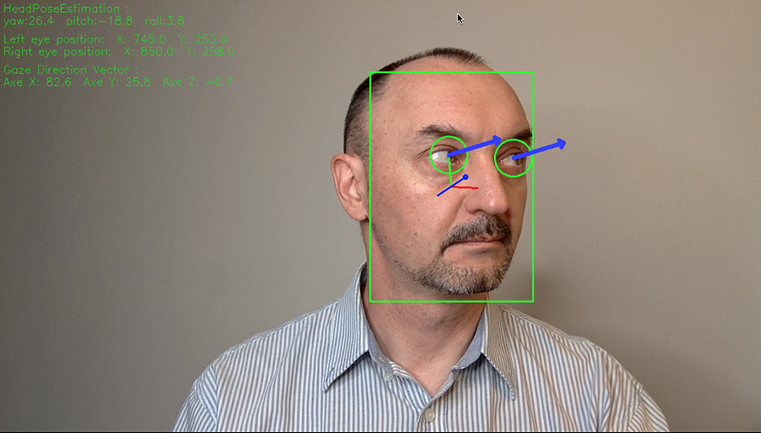

# Computer Pointer Controller

This is a Python Computer Pointer Controller created using Intel's OpenVINO Machine Learning toolkit. The program evaluates the gaze direction and moves the mouse pointer accordingly. It can use video or webcam as input. You can also see the data of the program overlaid on the video.



You can watch my test video of using this program here [https://www.youtube.com/watch?v=u1jHCieSDFE](https://www.youtube.com/watch?v=u1jHCieSDFE)

## Project Set Up and Installation
Project was tested in MacOS using CPU. Same set up instruction can be used for Linux, and with some small changes it can works on Windows

####1. OpenVINO instalation
Download OpenVINO instalation files from [here](https://docs.openvinotoolkit.org/latest/index.html) and follow original [instructions](https://docs.openvinotoolkit.org/latest/openvino_docs_install_guides_installing_openvino_macos.html)

####2. Virtual environment set up
Recuirements: Python3 should be installed. I set my Virtualenv in the folder ```~/env/openvino_gaze``` in code below. Path to virtual environment can be changed if need.

```
cd ~/env
virtualenv -p python3 ./openvino_gaze
cd openvino_gaze
source bin/activate

#install libraries requirements from project:
pip install -r <path to project>/requirements.txt
```
####3. Download the models
Download pre-trained models from [Intel Model Zoo](https://docs.openvinotoolkit.org/latest/omz_models_intel_index.html) using the [OpenVINO model downloader](https://docs.openvinotoolkit.org/latest/omz_tools_downloader_README.html). We need to download next models:

* [Face Detection](https://docs.openvinotoolkit.org/latest/omz_models_intel_face_detection_adas_binary_0001_description_face_detection_adas_binary_0001.html)
* [Head Pose Estimation](https://docs.openvinotoolkit.org/latest/omz_models_intel_head_pose_estimation_adas_0001_description_head_pose_estimation_adas_0001.html)
* [Facial Landmarks Detection](https://docs.openvinotoolkit.org/latest/omz_models_intel_landmarks_regression_retail_0009_description_landmarks_regression_retail_0009.html)
* [Gaze Estimation](https://docs.openvinotoolkit.org/latest/omz_models_intel_gaze_estimation_adas_0002_description_gaze_estimation_adas_0002.html)

All models was downloaded to folder ```<path to project>/gaze-estimation-openvino/models ``` Models downloading code:

```
cd ~/env/openvino_gaze/
source bin/activate

python3 /opt/intel/openvino/deployment_tools/tools/model_downloader/downloader.py --help

cd <path to project>/gaze-estimation-openvino

# face-detection-adas-0001 model downloading (FP32, FP16, INT8)
python3 /opt/intel/openvino/deployment_tools/tools/model_downloader/downloader.py --name face-detection-adas-0001 --precisions FP32 -o ./models
python3 /opt/intel/openvino/deployment_tools/tools/model_downloader/downloader.py --name face-detection-adas-0001 --precisions FP16 -o ./models
python3 /opt/intel/openvino/deployment_tools/tools/model_downloader/downloader.py --name face-detection-adas-0001 --precisions INT8 -o ./models

# face-detection-adas-binary-0001 model downloading (FP32)
python3 /opt/intel/openvino/deployment_tools/tools/model_downloader/downloader.py --name face-detection-adas-binary-0001  -o ./models

# landmarks-regression-retail-0009 model downloading (FP32, FP16)
python3 /opt/intel/openvino/deployment_tools/tools/model_downloader/downloader.py --name landmarks-regression-retail-0009 --precisions FP32 -o ./models
python3 /opt/intel/openvino/deployment_tools/tools/model_downloader/downloader.py --name landmarks-regression-retail-0009 --precisions FP16 -o ./models

# head-pose-estimation-adas-0001 model downloading (FP32, FP16)
python3 /opt/intel/openvino/deployment_tools/tools/model_downloader/downloader.py --name head-pose-estimation-adas-0001 --precisions FP32 -o ./models
python3 /opt/intel/openvino/deployment_tools/tools/model_downloader/downloader.py --name head-pose-estimation-adas-0001 --precisions FP16 -o ./models

# gaze-estimation-adas-0002 model downloading (FP32, FP16)
python3 /opt/intel/openvino/deployment_tools/tools/model_downloader/downloader.py --name gaze-estimation-adas-0002 --precisions FP32 -o ./models
python3 /opt/intel/openvino/deployment_tools/tools/model_downloader/downloader.py --name gaze-estimation-adas-0002 --precisions FP16 -o ./models

```

## Demo
Here example how to run a basic demo :

```
cd ~/env
cd openvino_gaze
source bin/activate
source /opt/intel/openvino/bin/setupvars.sh
cd ~/gitHub/gaze-estimation-openvino
# inference video in FP32 mode
python3 src/main.py -i video -c preferences_FP32.yaml --overlay --mouse_move
# inference video in FP16 mode
python3 src/main.py -i video -c preferences_FP16.yaml --overlay --mouse_move

```

## Documentation
*TODO:* Include any documentation that users might need to better understand your project code. For instance, this is a good place to explain the command line arguments that your project supports.


### Command line arguments

This project supports next command line arguments:

| Argument                 | Description                                                               | 
| ------------------------ | ------------------------------------------------------------------------- | 
| -c / --config_file       | Path to Preferences YAML file                                             |  
| -i / --input             | Input type: 'video' for video file or 'cam' for camera.                   | 
| -d / --device            | Specify device for inference: CPU, GPU, FPGA or MYRIAD (default CPU)      | 
| -pt / --prob_threshold   | Probability threshold for detections filtering (0.5 by default)           | 
| -o / --overlay           | Overlay models output on video.                                           | 
| -m / --mouse_move        | Move mouse based on gaze estimation output                                | 

Preferences YAML file is created to keep all paths and make command line more simple. It can be created and edited using any text editor. Example of Preferences YAML here:

```
# preferences
models:
    face_detection: ./models/intel/face-detection-adas-binary-0001/FP32-INT1/face-detection-adas-binary-0001.xml
    facial_landmarks_detection: ./models/intel/landmarks-regression-retail-0009/FP32/landmarks-regression-retail-0009.xml
    gaze_estimation: ./models/intel/gaze-estimation-adas-0002/FP32/gaze-estimation-adas-0002.xml
    head_pose_estimation: ./models/intel/head-pose-estimation-adas-0001/FP32/head-pose-estimation-adas-0001.xml
video_path: ./bin/demo.mp4
```


## Benchmarks
Tests on MacBook Pro on 2.5 GHz Quad-Core Intel Core i7 CPU

| Model       | Load Time FP32   | Load Time FP16 | Inference Time FP32 | Inference Time FP16 |
|---------------------|--------------|-----------|-------------|-----------|
|Face Detection       |  	291.1ms   |   NA       | 15.7ms       | NA     |
|Landmarks Detetion   |  	137.7ms   |   119.4ms  | 0.7ms       | 0.5ms     |  
|Head Pose Estimation |  	96.8ms    |   103.1m    | 1.7ms       | 1.3ms     |
|Gaze Estimation      | 	114.7ms   |   113.5ms   | 2.0ms       | 1.6ms     |
||||||


## Results
* Inference time for models with FP32 is larger than FP16 
* Load time for models with FP32 a bit more than FP16 with some exceptions 
* unfortunally I can not test models on GPU on my MacBook Pro as Apple stop support NVIDIA GPU drivers
